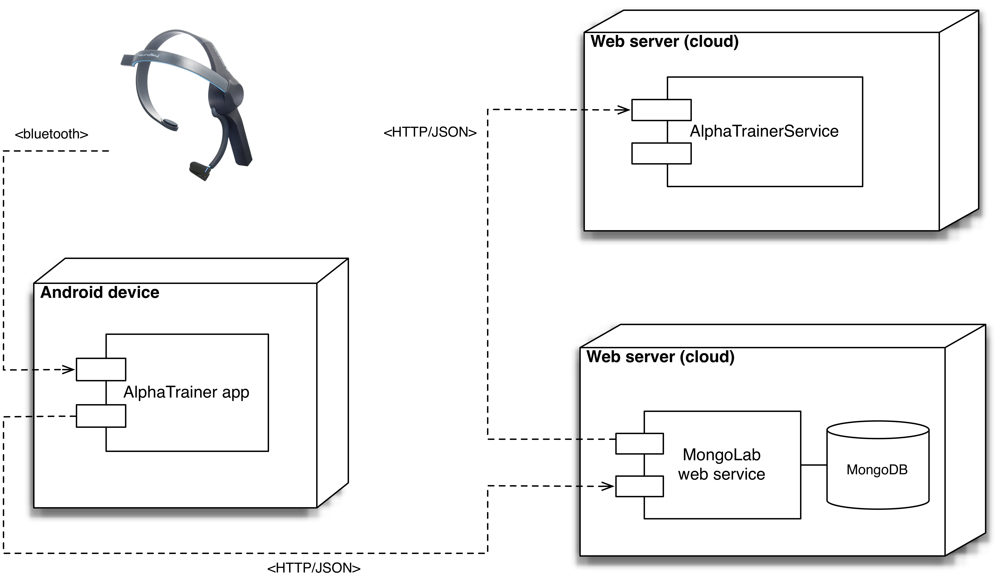
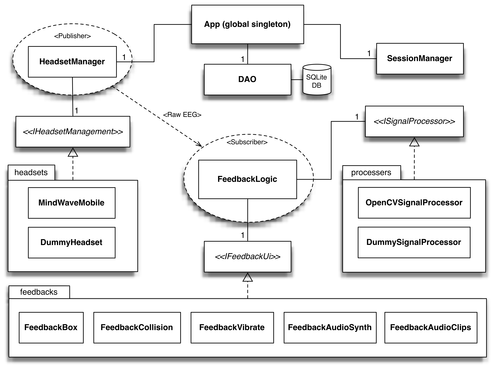
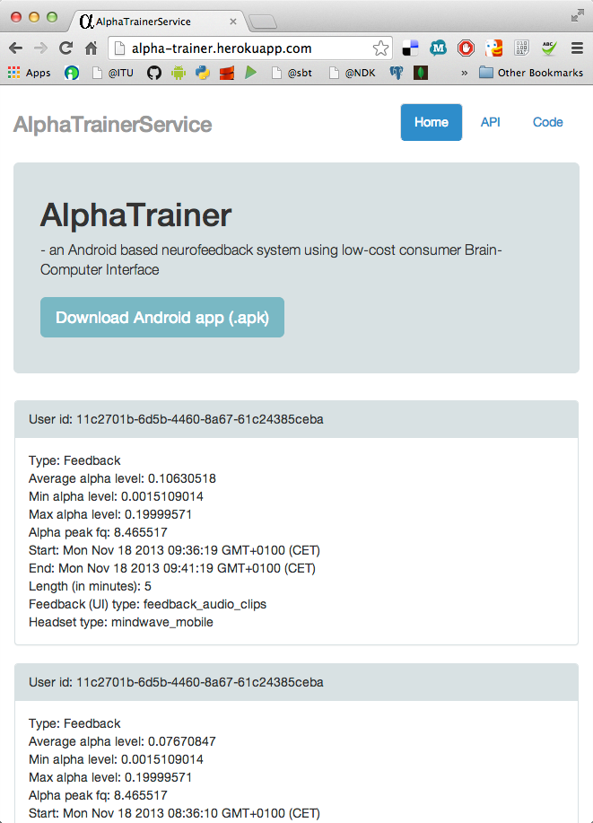

.. _ch-implementation:

================
 Implementation
================

.. _fig-implementation-alphatrainer-system-overview:

    
    Overview of the AlphaTrainer system components

AlphaTrainer is a system composed of several components. This chapter presents
each of their implementation. Figure |nbsp|
:num:`fig-implementation-alphatrainer-system-overview` gives an overview of
the different parts of AlphaTrainer and their relationship.

.. _ch-implementation-signal-processing-library:

Signal processing library
=========================

Starting low level, we have implemented a small *C++* library for processing raw
EEG data (Appendix |nbsp|
:ref:`appendix-alphatrainer-signal-processing-library`). It is based on the
open-source OpenCV 2 library |nbsp| [#foot-implementation-open-cv]_.

OpenCV is primarily used for computer vision and contains methods for image
analysis and processing. OpenCV 2 has been rewritten from *C* to *C++* and is
optimized to handle numerical data like vectors or matrices of float values
|nbsp| :cite:p:`baggio_mastering_2012`. This is exactly what we need when
processing EEG data which at this level is represented as
arrays of float values.

The implementation of this library is based on the signal processing and EEG
data knowledge gained from the BCI Evaluation Chapter |nbsp|
:ref:`ch-experiment`. The strategies, algorithms and data cleaning are roughly
mirrored 1:1 in this library the main difference being that this library is
intended for real-time usage.

Implementing the signal processing in C++ was chosen due to its performance
advantages over Java in regard to numerical manipulation
:cite:p:`ratabouil_android_2012`. This may seem overkill for the current
MindWave BCI configuration in which 512 data points are processed every second,
but it secures scalability for future headsets presumably increasing sample rate
and depth. For the same reason, we refrain from making the assumption that a headset
carries only one channel by letting the library support multichannel EEG data 
|nbsp| [#foot-implementation-multichannel-eeg]_.

The library can be called from the Java Virtual Machine (JVM) through the Java
Native Interface (JNI) |nbsp| [#foot-implementation-java-jni]_ |nbsp|
:cite:p:`liu_android_2013`.

Usage of the library is defined in the ``opencvbrainprocessor.h`` interface:

.. tired cpp and or c++ but didn't work (TM) so lets guess:

.. code-block:: guess
   :linenos:
   :emphasize-lines: 6,7,8

    #include "opencv2/core/core.hpp"
    #include "signalprocessingutil.h"

    #ifndef OPENCVBRAINPROCESSOR_H_
    #define OPENCVBRAINPROCESSOR_H_

    float getBrainProcessed(float eeg[], int channels, int samples, int Fs, 
                            float lowCutFq, float highCutFq, float alphaPeak);
    float getAlphaPeak(float eeg[], int channels, int samples, int Fs);
    void getMinMax(float alphaLevels[], float* result, int alphaLevelsLength, int factor);
    #endif /* OPENCVBRAINPROCESSOR_H_ */

This interface is implemented in ``opencvbrainprocessor.cpp``. It contains three
methods which in combination make up our signal processing. We now briefly
explain the substance of each method.

The ``getRelativeAlphaLevel()`` method computes the relative alpha level taking
raw EEG data and the alpha peak frequency as input. The procedure consists of:
(*i*) applying FFT to the EEG data; (*ii*) then for each frequency bin of the
FFT output, the value is squared (to go from amplitude to power); finally
(*iii*) return the relative alpha level which is calculated by dividing the
power of the alpha band (defined as 1 Hz to either side of the alpha peak
frequency) with the power of the total band (defined as the band between the
lowCutFq and highCutFq parameters).  During the BCI evaluation we had good
experiences with a low cut frequency of 5 Hz and a high cut frequency of 25
Hz (:ref:`ch-experiment-processing`). These values are currently used by AlphaTrainer.

The ``getAlphaPeak()`` method computes which frequency has the highest occurring
amplitude within the alpha band (7 Hz - 13 Hz) taking raw EEG (recorded during
calibration) as input. The procedure is this: (*i*) apply FFT to the EEG data;
(*ii*) trim the resulting frequency domain down to the alpha band and; (*iii*) find
the maximum amplitude and return the corresponding frequency.

Finally, the method ``getMinMax()`` computes how alpha levels should be mapped
to feedback states.  The resulting min and max values determine, for example,
the thresholds for the Box feedbacks red and green states. It takes an array of
relative alpha levels (from a baseline recording) as input. The procedure is to:
(*i*) calculate mean and standard deviation of the input alpha levels; (*ii*)
set min/max values to mean +/- the standard deviation multiplied with a factor
(a method parameter); finally (*iii*) if min < 0 it is replaced by the lowest
appearing value in the input data.

By design, this signal processing library is kept stateless. For example, it
receives the alpha peak frequency and sample rate for every alpha level
processing call. Keeping the processing module stateless simplifies the
integration with the app by allowing a low coupling. This will be elaborated in
the following section in which the library's user - the Android app - is
explained.

Android app
===========

Android is an open source operating system (OS) for mobile devices initiated by
Google. Our rationales for choosing
this platform includes that: (*i*) fits well for prototyping; (*ii*) has gained wide
adoption; and (*iii*) has unrestricted deployment to end users through the Google Play store.

Android is a mature OS and is currently released in version 4.4. AlphaTrainer
requires Android 3.0 (API level 9) or later |nbsp|
[#foot-implementation-android-api-level]_.

An introduction to the Android programming model is out of scope - the interested reader
is referred to the comprehensive official documentation |nbsp| [#foot-implementation-android]_.
Instead, this section will focus on the overall architecture and the most important design patterns
used in the AlphaTrainer Android app implementation.

Overview
--------

.. _fig-implementation-alphatrainer-android-app-architecture:

    
    AlphaTrainer Android app architecture overview.

An overview of the architecture is shown in Figure |nbsp|
:num:`fig-implementation-alphatrainer-android-app-architecture`. The diagram is
by no means exhaustive and the aim is to highlight the relationships between
BCIs (headsets), data processing, feedback views, application state and
persistent storage. This diagram will function as the reference throughout the
presentation of the Android app in the succeeding sections.

A main architectural goal of the implementation is a modular design which
enables replacement of the different components i.e. the headset, data processor
or the feedback view. How modularity is achieved will emerge during the
discussion of the individual components and their relations to other components.

State management
----------------

We take a singleton approach |nbsp| :cite:p:`bloch_effective_2008` to global app
state management. The singleton is implemented in the ``App`` class which
extends the Android framework ``Application``. In short, the Android framework
guarantees that exactly one instance of the class is loaded at all times
throughout the lifetime of the application, which makes it safe to write a
``getInstance()`` method |nbsp| [#foot-implementation-android-application]_.
Our application singleton is the center point for: (*i*) reading user
preferences which takes place in the ``SessionManager``; (*ii*) reading and
writing from persistent storage which takes place in the data access object
``DAO``; and (*iii*) managing headset connection which is takes place in
``HeadsetManager`` as well as in the singleton itself.

.. [#foot-implementation-android-application] `<http://developer.android.com/reference/android/app/Application.html>`_

Headset
-------

To support future consumer BCIs such as the already announced Muse and Emotiv
INSIGHT (see Section |nbsp|
:ref:`ch-background-future-headsets`), we have put effort into
being as headset agnostic as
possible. Implementing the signal processing ourselves is one way of doing so
since this allows us not to rely on the signal processing abilities of a
specific BCIs SDK.

Another way to obtain headset agnosticism is by communicating with the specific
BCIs through a thin interface thus abstracting from the specific BCIs API by
wrapping it in an implementation of the ``<<IHeadsetManagement>>`` interface:

.. code-block:: java
   :linenos:
   :emphasize-lines: 2

    package dk.itu.alphatrainer.interfaces;
    public interface IHeadset {
        public int getNrOfChannels();
        public int getSampleRate();
        public int getIcon();
    }
    public interface IHeadsetManagement extends IHeadset {
        public void startDataStream();
        public void stopDataStream();
    }

Only the ``HeadsetManager`` uses the ``<<IHeadsetManagement>>`` interface. All other
communication with the headset goes through the methods defined by ``<<IHeadset>>``
through which meta-data about the headset can be accessed.

AlphaTrainer currently contains two ``<<IHeadsetManagement>>`` implementations:
``DummyHeadset`` and ``MindWaveMobile`` - both in the
``dk.itu.alphatrainer.headset`` package. The ``DummyHeadset`` is used for
development and testing and it outputs a random signal.  The ``MindWaveMobile``
implements and uses the *ThinkGear* API |nbsp|
[#foot-implementation-thinkgear-api]_ bundled with the MindWave Mobile headset
(Section |nbsp| :ref:`ch-background-mindwave`). Concrete communication with the
MindWave headset goes through the ``TGDevice`` class. An example of the
``<<IHeadsetManagement>>`` interface implementation is shown below:

.. code-block:: java
   :linenos:
   :emphasize-lines: 5,6,18,37

    package dk.itu.alphatrainer.headset;
    ...
    import com.neurosky.thinkgear.TGDevice;
    public class MindWaveMobile implements IHeadsetManagement {
        private BluetoothAdapter bluetoothAdapter;
        private TGDevice tgDevice;
        ...
        public MindWaveMobile(IHeadsetListener listener) {
            this.listener = listener;
        }
        ...
        @Override
        public void startDataStream() {
            ...
            bluetoothAdapter = BluetoothAdapter.getDefaultAdapter();
            ...
            if (bluetoothAdapter != null) {
                tgDevice = new TGDevice(bluetoothAdapter, handler);
            }
            ...
            tgDevice.connect(true);
            ...
        }
        @Override
        public void stopDataStream() {
            tgDevice.stop();
            tgDevice.close();
        }
        ...

Distribution of data from the headset is implemented in a publish subscribe pattern.
In order to receive data from the headset, a class must implement the ``<<IHeadsetDataListener>>``
interface:

.. code-block:: java
    :linenos:
    :emphasize-lines: 1-3

    package dk.itu.alphatrainer.interfaces;
	public interface IHeadsetDataListener {
        public void onDataPacket(int channels, float[][] data);
    }

Whenever a headset receives data, it calls its ``<<IHeadsetListener>>`` with the data formatted
in the form of an array of float arrays each representing an EEG channel. This will
always be the ``HeadsetManager`` which is the only class implementing the ``<<IHeadsetListener>>``
interface which generalizes the ``<<IHeadsetDataListener>>`` and ``<<IHeadsetConnectionStatusListener>>``
interfaces. The HeadsetManager then distributes the data to each of its registered
``<<IHeadsetDataListener>>`` thus carrying out the publisher act. Below we see an example
showing how the private class ``CalibrationDataHandler`` within ``ActivityCalibrate``
first registers itself for receiving EEG data (l. 7) and later calls the headset for
meta-data (l. 8-9).

.. For example the ``MindWaveMobile`` is call up the headset factory like in the ``ActivityCalibrate`` class:

.. code-block:: java
   :linenos:
   :emphasize-lines: 7,8

    package dk.itu.alphatrainer.calibration;
    ...
    private class CalibrationDataHandler implements IHeadsetDataListener {
    	...
        public CalibrationDataHandler(ActivityCalibrate parent) {
            this.parent = parent;
            App.getInstance().getHeadsetManager().subscribeData(this);
            Fs = App.getInstance().getHeadsetManager().getHeadset().getSampleRate();
            int numberOfChannels = App.getInstance().getHeadsetManager().getHeadset().getNrOfChannels();
            ...

The distribution of connection status updates is similarly implemented in a
publish subscribe pattern using the ``<<IHeadsetConnectionStatusListener>>``
interface.

Since the headset can be changed by the user through a settings entry and we
generally want the app to depend as little as possible on the concrete
headset implementations, we have implemented the factory pattern. Specifically,
the headsets are instantiated by the ``HeadsetFactory`` in the package
``dk.itu.alphatrainer.factories`` which is responsible for instantiating a concrete
headset appropriate for the current headset settings entry.

Signal processing
-----------------

.. Down state agnostic here be cause we actually call up the OpenCVSignalProcessor directly in the FeedbackLogic and not a ProcessorFactory...

The implementation of the signal processing takes the same approach as was
taken with the
headsets to achieve modularity.
Again, the communication goes through a thin interface which allows for
easy replacement of the signal processing module.

.. code-block:: java
   :linenos:
   :emphasize-lines: 3,8

    package dk.itu.alphatrainer.interfaces;
    import dk.itu.alphatrainer.model.AlphaMinMax;
    public interface ISignalProcessor {
        public void getBandPower(float[][] data, int Fs, float alphaPeak);
        public float getAlphaPeak(float[][] data, int Fs);
        public AlphaMinMax getMinMax(float[] alphaPowers); 
    }
    public interface ISignalProcessingListener {
        public void onSignalProcessed(float bandPower);
    }

``<<ISignalProcessor>>`` is currently implemented by ``DummySignalProcessor`` and
``OpenCVSignalProcessor`` found in the ``dk.itu.alphatrainer.signalprocessing``
package. The ``DummySignalProcessor`` is for development and testing, and it
simply outputs dummy values. ``OpenCVSignalProcessor`` encapsulates the OpenCV
based library described in Section |nbsp|
:ref:`ch-implementation-signal-processing-library`. In the example below,
important lines of
``OpenCVSignalProcessor`` are shown in which it receives its listener
in the constructor and
declares its usage of the C++ library (Section |nbsp|
:ref:`ch-implementation-signal-processing-library`) through the ``native``
keyword:

.. code-block:: java
   :linenos:
   :emphasize-lines: 1,5

    package dk.itu.alphatrainer.signalprocessing;
    ...
    public class OpenCVSignalProcessor implements ISignalProcessor {
        ...
        private ISignalProcessingListener listener;
        public OpenCVSignalProcessor(ISignalProcessingListener listener) {
            this.listener = listener;
        } 
        ...
        public native float getRelativeAlphaLevel(float[] eeg, int samples, int Fs, float alphaPeak);
        ...

Data flow
---------

This section describes the data flow and call hierarchy involved from
the point where the BCI receives raw EEG data up till the point where the
feedback view is called with a processed and normalized alpha level.

As can be seen in the app overview diagram Figure |nbsp|
:num:`fig-implementation-alphatrainer-android-app-architecture`, the
``FeedbackLogic`` class connects the raw EEG data, the signal processing and the
feedback UI. Figure |nbsp| :num:`fig-flow-diagram-feedback` shows a
flow diagram of the calls involved from raw EEG is received to the feedback UI
is called. Notice how all calls between the classes are interface method calls
and would be exactly the same for other combinations of headset, processor and
feedback UI.

The diagram also shows our usage of the publish subscribe pattern in that the
``HeadsetManager`` distributes the received EEG data to all listeners
registered for receiving data.

.. _fig-flow-diagram-feedback:

.. figure:: fig/flow-diagram-feedback.png
    :alt: Flow from EEG to feedback
    :width: 100%
    :align: center
    
    Flow of data from from headset receiving raw EEG to the feedback is drawn.

.. .. code-block:: java
..    :linenos:
..    :emphasize-lines: 1,5

..     package dk.itu.alphatrainer.feedback;
..     ...
..     public class FeedbackLogic implements ISignalProcessingListener, IHeadsetDataListener {
..         ...

..         public FeedbackLogic(IFeedbackUi feedbackUi, int seconds, boolean isBaseline) {        
..             processor = new OpenCVSignalProcessor(this);
..             ...
..         }
..         ...
..         public void onDataPacket(int channels, float[][] data) {
..             ...
..             processor.getBandPower(alphaPeakFq, App.getInstance().getHeadsetManager().getHeadset().getSampleRate(),
..                     data, App.getInstance().getHeadsetManager().getHeadset().getSampleRate());
..             ...
..          }
..         ...
..         public void onSignalProcessed(float bandPower) {
..             int normalizedAlphaLevel = getNormalizedAlphaLevel(bandPower);
..             ...

.. .. code-block:: java
..    :linenos:
..    :emphasize-lines: 6,10,16,21

..     package dk.itu.alphatrainer.feedback;
..     public class FeedbackLogic implements ISignalProcessingListener,
..             IHeadsetDataListener {
..         ...
..         private ISignalProcessor processor;
..         private IFeedbackUi feedbackUi;
..         ...
..         public FeedbackLogic(IFeedbackUi feedbackUi, int seconds, boolean isBaseline) {
..             ...
..             this.feedbackUi = feedbackUi;
..             ...
..         }
..         ...
..         public void stop() {
..             stopped = true;
..             feedbackUi.stop();
..             App.getInstance().getHeadsetManager().unsubscribeData(this);
..         }
..         public void onSignalProcessed(float bandPower) {
..             ...
..             feedbackUi.drawFeedback(normalizedAlphaLevel);
..             ...

.. _ch-implementation-feedback-ui-s:

Feedback user interfaces
------------------------

A feedback UI is generalized in a simple interface:

.. code-block:: java
   :linenos:
   :emphasize-lines: 2

    package dk.itu.alphatrainer.interfaces;
    public interface IFeedbackUi {
        public void drawFeedback(int i);
        public void stop();
    }

The ``drawFeedback()`` method takes a normalized alpha level from 0 to 100 and
transforms this number into a visible, auditive or tactile feedback to the user.
We have currently implemented 5 different feedback UIs found in the
``dk.itu.alphatrainer.ui.feedback`` package - reference the Design Chapter
|nbsp| :ref:`ch-design` for a visual and conceptual explanation of each feedback
Figure |nbsp| :num:`fig-final-prototype-app-feedbacks`. The feedback package
consists of:

1. *Box* is implemented in the ``FeedbackBox`` class. It uses build-in Android
   animation features to make the transitions from red to green depending on the
   normalized alpha level.

2. *Circles* is implemented in the ``FeedbackCollision`` class. It uses an
   Android WebView and the circles are based on the open-source visualization
   Javascript library *d3.js* |nbsp| [#foot-implementation-d3js]_. The WebView
   loads the Javascript and HTML/CSS from the Android specific *assets* folder
   within the AlphaTrainer Android app.
   On receiving a normalized alpha level, ``FeedbackCollision`` dispatches it
   to the WebView which handles the feedback actuation in a Javascript method.

3. *Vibration* is implemented in the ``FeedbackVibrate`` class and utilizes the
   Android system service architecture through which the vibration of the phone
   can be accessed.

4. *Tone* is implemented in the ``FeedbackAudioSynth`` class. It uses the build
   in Android audio library in conjunction with pure Java to crate a small
   synthesizer.

5. *Bells* is implemented in the ``FeedbackAudioClips`` class. It uses another
   build in Android audio library able to load and play sound clips from files.

Similar to the headsets, the feedbacks can be changed by the user through a setting.
For the same reason, we also use the factory pattern to 
instantiate a concrete feedback UI class. This responsibility is delegated
to the ``FeedbackUiFactory`` which read the user setting and instantiate the
appropriate feedback.

.. _ch-implementation-models-persistent-storage:

Models and persistent storage
-----------------------------

We have benefited of the built in SQLite |nbsp| [#foot-implementation-sqlite]_ database
within the Android framework. All training data such as alpha peak frequencies and
the relative alpha levels are timestamped and persistently stored in the SQLite database
from where they can be
queried with SQL |nbsp| [#foot-implementation-sql]_. The raw EEG data is currently
stored in plain text files on the mobile device's SD card.

All concrete database communication takes place in the ``DAO`` class from the
``dk.itu.alphatrainer.datastorage`` package. This encapsulation
represents another typical design-pattern with Java and Android
|nbsp| :cite:p:`wei_android_2012`.

We have modeled a training and a processed alpha level respectively as
``Recording`` and ``AlphaLevel`` classes within the ``dk.itu.alphatrainer.model`` package.
Below a snippet from the ``AlphaLevel`` class:

.. code-block:: java 
   :linenos: 
   :emphasize-lines: 6,10,16,21

    package dk.itu.alphatrainer.model;
    ...
    import com.google.gson.annotations.Expose;
    import com.google.gson.annotations.SerializedName;
    ...
    public class AlphaLevel {
        @Expose
        @SerializedName("alpha_level")
        private float alphaLevel;
        @Expose
        @SerializedName("normalized_alpha_level")
        private int normalizedAlphaLevel;
        @Expose
        @SerializedName("time_stamp")
        private long timeStamp;
        public AlphaLevel(float alphaLevel, int normalizedAlphaLevel, long timeStamp) {
            this.alphaLevel = alphaLevel;
            this.normalizedAlphaLevel = normalizedAlphaLevel;
            this.timeStamp = timeStamp;  
        }
        public float getAlphaLevel() {
            return alphaLevel;
        }
        public int getNormalizedAlphaLevel() {
            return normalizedAlphaLevel;
        }
        public long getTimeStamp() {
            return timeStamp;
        }
    }

Some fields of the ``AlphaLevel`` class are annotated with ``@Expose`` and ``@SerializedName``.
This is part of the Gson library |nbsp| [#foot-implementation-gson]_ which we use to serialize the models to JavaScript objects (JSON) |nbsp| [#foot-implementation-json]_. With the annotations we can control which fields of the class should be serialized and how the naming should be. We post the JSON serialized
training data to a cloud based web service over HTTP, which is elaborated below in Section |nbsp| :ref:`ch-implementation-alphatrainer-cloud-based-storage`). The JSON training object has this structure:

.. code-block:: json
   :linenos:

    { 
        "user_id" : "9cc6e095-4efa-4cc2-85ff-c792b34e40f5" , 
        "type" : "Baseline" , 
        "alpha_levels" : [ 
            { 
                "time_stamp" : 1382695986 , 
                "normalized_alpha_level" : 6 , 
                "alpha_level" : 0.016940186
            },
            ...
        ] , 
        "headset_type" : "mindwave_mobile" , 
        "feedback_ui_type" : "feedback_audio_clips" , 
        "average_alpha_level" : 0.07930513 , 
        "time_stamp_start" : 1382695986 , 
        "time_stamp_end" : 1382696286 , 
        "length" : 300 , 
        "max_alpha_level" : 0.15 , 
        "min_alpha_level" : 0.008 , 
        "alpha_peak_fq" : 9.362069
    }

The ``user_id`` is in an id anonymously generated client side (in the Android app)
using the ``UUID`` class from the standard Java library. Generating and storing the id
client side ensures that the web service cannot know who the user behind the id is.

The actual post to the cloud based storage is handled in a non-blocking asynchronous
task - the ``PostRecordingToServiceTask`` class in the ``dk.itu.alphatrainer.cloud``
package - which is called when a feedback or baseline recording is finished. If the
recording is not successfully posted to the service (which is identified by the absence
of a returned row-number from the service), this will be attempted again later.

.. _ch-implementation-alphatrainer-cloud-based-storage:

Cloud based storage
===================

.. AlphaTrainserService

The AlphaTrainer system currently relies on a cloud based NoSQL database to
store training data from its users (Appendix |nbsp|
:ref:`appendix-alphatrainer-mongolab-cloud-storage`). We currently use the
open-source MongoDB |nbsp| [#foot-implementation-mongodb]_ database hosted in the cloud
as a service by MongoLab |nbsp| [#foot-implementation-mongolab]_ - but MongoDB can in
principle be installed anywhere. MongoDB is a document based database opposed
to a traditional relational database like SQLite which we use within the
AlphaTrainer Android app (Section |nbsp|
:ref:`ch-implementation-models-persistent-storage`). MongoDB stores data, for
example a training session including an array of alpha levels, as documents
grouped into collections - the
documents are very similar to JSON objects |nbsp|
:cite:p:`nayak_instant_2013`.

This database storage choice for the current AlphaTrainer system is founded in
the *software as a service* (SaaS) concept - "*... SaaS delivers software and
data as a service over the internet ...*" |nbsp|
:cite:p:`fox_engineering_2013`. Advantages of the cloud based MongoDB at
MongoLab include that we can access it: (*i*) through command line and do queries
directly in the database; (*ii*) through a specific language dependent driver
for example for Java; finally (*iii*) MongoLab exposes an RESTful web service
API out of the box offering Create, Read, Update and Delete (CRUD) operations
|nbsp| :cite:p:`coulouris_distributed_2012`. This cloud service component of the
AlphaTrainer system enables the AlphaTrainer Android app to upload training
data which can be consumed by the AlphaTrainerService Client explained
below in Section |nbsp| :ref:`ch-implementation-alphatrainer-service-client` and
any future clients with the need for accessing the data - for example a client created
for usage by a clinical professional.

At last we show our usage of one of the features MongoDB offers, namely the ability to map
reduce large data set - the map reduce concept is taken from
functional programming |nbsp| :cite:p:`abelson_structure_1996`. The following example
shows how all the average alpha level per user interface can be 
queried from all recordings in the training dataset through map reduction:

.. code-block:: javascript
   :linenos:

    var mapFeedbackUIAvgAlpha = function() {
      emit(this.feedback_ui_type, this.average_alpha_level);
    };
    var reduceAvgAlpha = function(feedbackUIType, averageAlphaLevel) {
      return Array.avg(averageAlphaLevel);
    };
    function showFeedbackUITypeAvgAlphaLevelAvg() {
      db.trainings.mapReduce( 
        mapFeedbackUIAvgAlpha, 
        reduceAvgAlpha, 
        { out: "feedback_ui_alpha_average" });
      return db.feedback_ui_alpha_average.find();
    }
    showFeedbackUITypeAvgAlphaLevelAvg();

First the function maps all the feedback user interfaces and average alpha levels
from all the trainings and then reduce it by averaging the items created in the
map step. This procedure produces the following JSON response:

.. code-block:: json
   :linenos:

    { "_id" : "feedback_box", "value" : 0.09779977771875001 } // Box
    { "_id" : "feedback_collision", "value" : 0.09649314506956522 } // Circles
    { "_id" : "feedback_vibrate", "value" : 0.14137012283529413 } // Vibrate
    { "_id" : "feedback_audio_clips", "value" : 0.0934931038888889 } // Bells
    { "_id" : "feedback_audio_synth", "value" : 0.11333089719230771 } // Tone

This in an example of a query which would be really interesting to run when AlphaTrainer
(hopefully) has been used by many people over a long period of time. We return to this
perspective in the Future works Section |nbsp| :ref:`sec-future-work`.

.. _ch-implementation-alphatrainer-service-client:
  
AlphaTrainserService Client
---------------------------

We have created a simple *webapp* client - AlphaTrainserService
which can consume the cloud based storage at MongoLab (Appendix |nbsp|
:ref:`appendix-alphatrainerservice-client`). At the moment this webapp
simply allows viewing the recorded data grouped by (anonymous) users and
their training sessions, see  Figure |nbsp| :num:`fig-alpha-trainer-service`.

.. _fig-alpha-trainer-service:

    
    Screenshot of the AlphaTrainerService webapp

The AlphaTrainserService webapp is implemented with the Play Framework |nbsp|
[#foot-implementation-playframework]_ which is written in Scala
|nbsp| [#foot-implementation-scala]_ - a functional
programming language built on top of Java
|nbsp| :cite:p:`hilton_play_2013`. The webapp uses the the Bootstrap front-end
framework |nbsp| [#foot-implementation-bootstrap]_ for the user interface combined with
BackBone.js |nbsp| [#foot-implementation-backbonejs]_ - a MVC based JavaScript
framework. Bootstrap is highly flexible and
met our simple UI requirements out of the box. BackBone.js is used to
continuously pull in new training recordings without reloading the webpage |nbsp|
:cite:p:`mirgorod_backbone._2013`.

The AlphaTrainserService Client is currently deployed to Heroku
|nbsp| [#foot-implementation-heroku]_ - a SaaS hosting environment built on top of the
Amazon AWS infrastructure |nbsp| [#foot-implementation-aws]_.

JSON and RESTful web service are first citizen concepts within the Play
Framework. This means AlphaTrainserService could also expose a web service if,
for example, the AlphaTrainer system should encounter requirements which can not
be meet by the MongoLab web service. Additionally, the Play Framework can be
used to build type-safe and a highly scalable web services as well.

With this cloud based client and data storage in hand we have a solid, flexible
and highly scalable storage as an important infra structure underneath the
AlphaTrainer Android application.

Summary
=======

In this chapter, we have explained the central concepts of the implementation
of AlphaTrainer. Most importantly, several design patterns have been applied
to ensure a modular architecture of the Android app. This enables easy support for
future headsets and new feedback views as well as replacement of the signal
processing. The modularity ensures that the contribution of implementing the
AlphaTrainer system still has value even if it should become apparent, for example,
that the current state of BCIs are not good enough for performing neurofeedback.

Through the explanation of the Android app, only few Android specific components
were mentioned. The same is true for the app overview diagram in
Figure |nbsp| :num:`fig-implementation-alphatrainer-android-app-architecture` which
has no dependencies on Android. This carries the point that we
have separated the logic as much as possible from the Android specific components.
This makes it easy to port the application to, for example, iOS even though it 
will have to be rewritten in Objective C for the iOS environment.
The concepts are the same and the native signal processing library
can even be compiled to and called from iOS as well. The cloud based storage
is of course agnostic in regard to the OS of its clients as long as they speak HTTP.

The scalable cloud based approach to data storage and the simple webapp consuming this
data makes the proof of concept that the AlphaTrainer system could easily be integrated in,
for example, a
clinical context - in which case a client for the clinician would have to be designed and build
for this purpose. This would raise some solvable security issues deemed out of scope for this
AlphaTrainer system prototype.

.. rubric:: Footnotes

.. [#foot-implementation-multichannel-eeg] Multichannel EEG would require small adjustments in regard to the communicating with the library.

.. [#foot-implementation-open-cv] `<http://opencv.org>`_

.. [#foot-implementation-java-jni] `<http://docs.oracle.com/javase/7/docs/technotes/guides/jni>`_.

.. [#foot-implementation-android] `<http://developer.android.com/>`_

.. [#foot-implementation-android-api-level] Main parts of the AlphaTrainer Android App work even from version 
   2.3 (API level 9) and up except of the Circle feedback covered within Section |nbsp| :ref:`ch-implementation-feedback-ui-s` 
   which relies on browsers that implement Scalable Vector Graphics (SVG).

.. [#foot-implementation-thinkgear-api] `<http://developer.neurosky.com/docs/doku.php?id=thinkgear_connector_tgc>`_

.. [#foot-implementation-d3js] *d3.js* is written in Javascript and it heavily relies on SVG - `<http://d3js.org>`_

.. [#foot-implementation-sqlite] `<http://www.sqlite.org/>`_

.. [#foot-implementation-sql] `<http://en.wikipedia.org/wiki/SQL>`_

.. [#foot-implementation-gson] `<https://code.google.com/p/google-gson>`_

.. [#foot-implementation-json] `<http://json.org>`_

.. [#foot-implementation-mongodb] `<http://www.mongodb.org>`_

.. [#foot-implementation-mongolab] `<https://mongolab.com>`_

.. [#foot-implementation-playframework] `<http://www.playframework.com>`_

.. [#foot-implementation-scala] `<http://www.scala-lang.org>`_

.. [#foot-implementation-bootstrap] `<http://getbootstrap.com>`_

.. [#foot-implementation-backbonejs] `<http://backbonejs.org>`_

.. [#foot-implementation-heroku] `<https://www.heroku.com>`_

.. [#foot-implementation-aws] `<http://aws.amazon.com>`_
